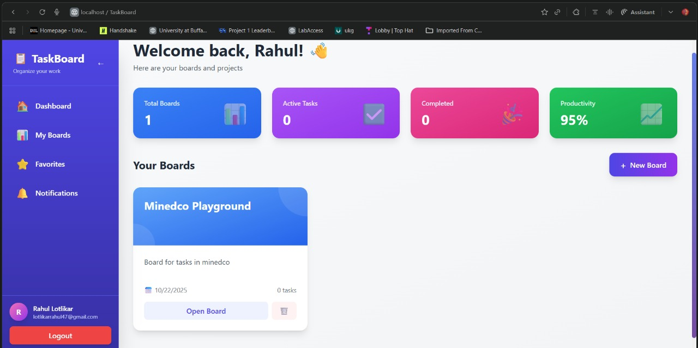
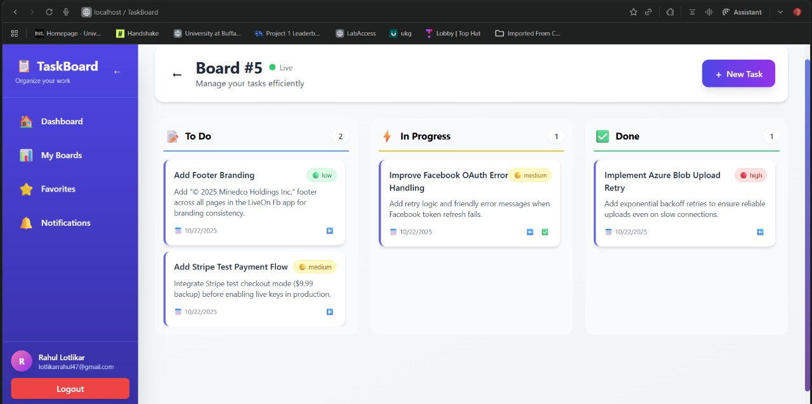
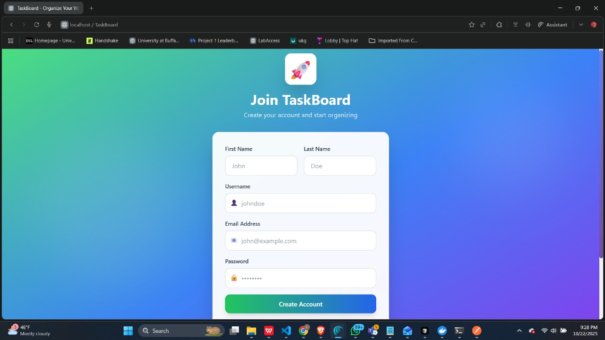

# 📋 TaskBoard - Enterprise-Grade Task Management System

[](https://golang.org/)
[](https://reactjs.org/)
[](https://www.typescriptlang.org/)
[](https://www.docker.com/)
[](https://www.postgresql.org/)
[](https://redis.io/)

A modern, full-stack task management application demonstrating production-ready Go backend architecture with real-time WebSocket updates, JWT authentication, and a polished React TypeScript frontend.



---

## 🎯 Project Overview

TaskBoard is a comprehensive task management system built to showcase enterprise-level software engineering practices. The application features a **robust Go backend** with clean architecture principles, **real-time collaboration** via WebSockets, and a **modern React frontend** with a delightful user experience.

### 🌟 Key Highlights

- **Clean Architecture**: Domain-driven design with clear separation of concerns
- **Production-Ready**: Docker containerization, environment-based configuration, structured logging
- **Real-Time Updates**: WebSocket hub implementation for instant task synchronization
- **Security First**: JWT authentication, password hashing with bcrypt, middleware-based authorization
- **Scalable Design**: Repository pattern, dependency injection, Redis caching layer
- **Modern Stack**: Go 1.23, Gin framework, GORM, PostgreSQL, Redis, React 18, TypeScript

---

## 🏗️ Technical Architecture

### Backend Architecture (Go)

```
backend/
├── cmd/api/              # Application entry point
├── internal/
│   ├── domain/           # Core business entities (User, Board, Task)
│   ├── repository/       # Data access layer (Repository pattern)
│   ├── service/          # Business logic layer
│   ├── handler/          # HTTP handlers (Controller layer)
│   ├── middleware/       # Authentication & CORS middleware
│   └── websocket/        # WebSocket hub for real-time updates
└── pkg/
    ├── config/           # Configuration management
    └── database/         # Database & Redis initialization
```

### Core Technical Components

#### 1. **Domain-Driven Design**
- **Clean separation** of business entities from infrastructure
- Entities: `User`, `Board`, `Task` with proper relationships
- GORM models with auto-migration support

#### 2. **Repository Pattern**
```go
type TaskRepository interface {
    Create(task *domain.Task) error
    GetByID(id uint) (*domain.Task, error)
    GetByBoardID(boardID uint) ([]domain.Task, error)
    Update(task *domain.Task) error
    Delete(id uint) error
}
```
- **Abstraction** over data access for testability
- Easy to swap implementations (e.g., mock for testing)
- Consistent error handling patterns

#### 3. **Service Layer**
- Encapsulates business logic separate from HTTP concerns
- Dependency injection for loose coupling
- Transaction management for data consistency

#### 4. **JWT Authentication**
```go
// Token generation with configurable expiry
claims := jwt.MapClaims{
    "user_id": userID,
    "exp":     jwt.NewNumericDate(time.Now().Add(24 * time.Hour)),
}
```
- Secure token-based authentication
- Middleware-based route protection
- User context propagation

#### 5. **WebSocket Real-Time Hub**
```go
type Hub struct {
    clients    map[*Client]bool
    broadcast  chan []byte
    register   chan *Client
    unregister chan *Client
}
```
- Concurrent-safe client management
- Broadcast messaging for task updates
- Automatic reconnection handling

#### 6. **Redis Caching Layer**
- Ready for session storage
- Prepared for rate limiting implementation
- Horizontal scaling support

---

## 🛠️ Technology Stack

### Backend
| Technology | Purpose | Highlights |
|------------|---------|------------|
| **Go 1.23** | Core Language | Type safety, concurrency, performance |
| **Gin** | HTTP Framework | Fast routing, middleware support, JSON binding |
| **GORM** | ORM | Auto-migrations, associations, query builder |
| **PostgreSQL** | Primary Database | ACID compliance, relational integrity |
| **Redis** | Cache/Sessions | In-memory speed, pub/sub ready |
| **JWT** | Authentication | Stateless, scalable auth mechanism |
| **Bcrypt** | Password Hashing | Industry-standard security |
| **WebSocket** | Real-Time | Bidirectional communication |

### Frontend
| Technology | Purpose | Highlights |
|------------|---------|------------|
| **React 18** | UI Framework | Hooks, concurrent rendering |
| **TypeScript** | Type Safety | Enhanced IDE support, fewer runtime errors |
| **Tailwind CSS** | Styling | Utility-first, responsive design |
| **React Router** | Navigation | SPA routing, protected routes |
| **Axios** | HTTP Client | Interceptors, request/response transformation |
| **Context API** | State Management | Authentication state, user context |

### DevOps
- **Docker & Docker Compose**: Multi-container orchestration
- **Multi-stage Builds**: Optimized image sizes
- **Environment Variables**: Configuration management
- **Auto-restart**: Production-ready container policies

---

## 🚀 Features

### ✅ User Management
- User registration with email validation
- Secure login with JWT tokens
- Password hashing with bcrypt (cost factor 14)
- User profile management

### 📊 Board Management
- Create multiple boards for project organization
- Update board details (title, description)
- Delete boards with cascade deletion of tasks
- Color-coded board cards with visual hierarchy

### 📝 Task Management
- **Kanban-style workflow**: To Do → In Progress → Done
- Task priority levels (Low, Medium, High)
- Task descriptions and metadata
- Due date tracking (ready for implementation)
- Assignee support (multi-user ready)
- Real-time task updates across all clients

### 🔄 Real-Time Collaboration
- WebSocket connection for instant updates
- Live task status changes
- Connection status indicator
- Automatic reconnection handling

### 📈 Dashboard Analytics
- **Dynamic Productivity Metrics**:
  - Total boards count
  - Active tasks (in progress)
  - Completed tasks
  - Productivity percentage: `(Completed / Total) × 100`
- Real-time stats updates
- Visual gradient cards with animations

### 🎨 Modern UI/UX
- Glassmorphism effects and gradients
- Smooth animations and transitions
- Responsive design (mobile, tablet, desktop)
- Dark mode ready (prepared for implementation)
- Custom scrollbars
- Loading states and error handling

---

## 📸 Application Screenshots

<div align="center">

### 🎯 Dashboard View

*Real-time productivity metrics, board overview, and beautiful gradient UI*

### 📋 Kanban Board

*Drag-and-drop task management with real-time WebSocket updates*

### 🔐 Modern Login

*Beautiful gradient UI with glassmorphism effects and smooth animations*

</div>

---

## 📦 Prerequisites

Before running this project, ensure you have the following installed:

- **Docker** (version 20.10+) & **Docker Compose** (version 2.0+)
  - [Install Docker Desktop](https://www.docker.com/products/docker-desktop)
- **Git** (version 2.30+)
  - [Install Git](https://git-scm.com/downloads)

**That's it!** Docker handles all dependencies (Go, Node.js, PostgreSQL, Redis).

---

## 🏃 Quick Start Guide

### Step 1: Clone the Repository

```bash
git clone https://github.com/YOUR_USERNAME/task-board.git
cd task-board
```

### Step 2: Environment Configuration (Optional)

The application works out-of-the-box with default settings. To customize:

```bash
# Backend configuration (optional)
cp backend/.env.example backend/.env

# Edit backend/.env with your preferred settings:
# - DB_HOST, DB_PORT, DB_USER, DB_PASSWORD, DB_NAME
# - REDIS_HOST, REDIS_PORT
# - JWT_SECRET (for production, use strong secret)
# - PORT (default: 8080)
```

### Step 3: Start the Application

```bash
# Build and start all services (PostgreSQL, Redis, Backend, Frontend)
docker-compose up -d --build

# View logs (optional)
docker-compose logs -f
```

**Startup time**: ~30-60 seconds for first build

### Step 4: Access the Application

- **Frontend**: http://localhost:3000
- **Backend API**: http://localhost:8080/api/v1
- **WebSocket**: ws://localhost:8080/api/v1/ws

### Step 5: Create Your First Account

1. Navigate to http://localhost:3000
2. Click **"Sign up"** (redirects to registration)
3. Fill in:
   - Email: your@email.com
   - Username: yourname
   - Password: securepassword123
   - First Name & Last Name (optional)
4. Click **"Register"**
5. Login with your credentials
6. Start creating boards and tasks!

---

## 🔧 Development Setup

### Running Without Docker (Advanced)

#### Backend Setup

```bash
cd backend

# Install Go dependencies
go mod download

# Start PostgreSQL and Redis (via Docker or local installation)
# PostgreSQL: localhost:5432
# Redis: localhost:6379

# Set environment variables
export DB_HOST=localhost
export DB_PORT=5432
export DB_USER=taskboard
export DB_PASSWORD=taskboard123
export DB_NAME=taskboard_db
export REDIS_HOST=localhost
export REDIS_PORT=6379
export JWT_SECRET=your-super-secret-key
export PORT=8080

# Run the application
go run cmd/api/main.go
```

#### Frontend Setup

```bash
cd frontend

# Install dependencies
npm install

# Set API URL
export REACT_APP_API_URL=http://localhost:8080/api/v1

# Start development server
npm start
```

---

## 🧪 Testing the Application

### API Testing with cURL

#### Register a User
```bash
curl -X POST http://localhost:8080/api/v1/auth/register \
  -H "Content-Type: application/json" \
  -d '{
    "email": "test@example.com",
    "username": "testuser",
    "password": "password123",
    "first_name": "Test",
    "last_name": "User"
  }'
```

#### Login
```bash
curl -X POST http://localhost:8080/api/v1/auth/login \
  -H "Content-Type: application/json" \
  -d '{
    "email": "test@example.com",
    "password": "password123"
  }'
```

#### Create a Board (requires JWT token)
```bash
curl -X POST http://localhost:8080/api/v1/boards \
  -H "Content-Type: application/json" \
  -H "Authorization: Bearer YOUR_JWT_TOKEN" \
  -d '{
    "title": "My Project",
    "description": "Project tasks"
  }'
```

#### Create a Task
```bash
curl -X POST http://localhost:8080/api/v1/tasks/board/1 \
  -H "Content-Type: application/json" \
  -H "Authorization: Bearer YOUR_JWT_TOKEN" \
  -d '{
    "title": "Implement feature X",
    "description": "Add new functionality",
    "priority": "high"
  }'
```

---

## 📚 API Documentation

### Authentication Endpoints

| Method | Endpoint | Description | Auth Required |
|--------|----------|-------------|---------------|
| POST | `/api/v1/auth/register` | Register new user | ❌ |
| POST | `/api/v1/auth/login` | Login user | ❌ |

### User Endpoints

| Method | Endpoint | Description | Auth Required |
|--------|----------|-------------|---------------|
| GET | `/api/v1/users/profile` | Get user profile | ✅ |
| PUT | `/api/v1/users/profile` | Update profile | ✅ |

### Board Endpoints

| Method | Endpoint | Description | Auth Required |
|--------|----------|-------------|---------------|
| POST | `/api/v1/boards` | Create board | ✅ |
| GET | `/api/v1/boards` | List user's boards | ✅ |
| GET | `/api/v1/boards/:id` | Get board details | ✅ |
| PUT | `/api/v1/boards/:id` | Update board | ✅ |
| DELETE | `/api/v1/boards/:id` | Delete board | ✅ |

### Task Endpoints

| Method | Endpoint | Description | Auth Required |
|--------|----------|-------------|---------------|
| POST | `/api/v1/tasks/board/:boardId` | Create task | ✅ |
| GET | `/api/v1/tasks/board/:boardId` | List board tasks | ✅ |
| GET | `/api/v1/tasks/:id` | Get task details | ✅ |
| PUT | `/api/v1/tasks/:id` | Update task | ✅ |
| DELETE | `/api/v1/tasks/:id` | Delete task | ✅ |

### WebSocket

| Endpoint | Description |
|----------|-------------|
| `ws://localhost:8080/api/v1/ws` | WebSocket connection for real-time updates |

**Message Types**: `task_created`, `task_updated`, `task_deleted`, `board_updated`

---

## 🎓 Go Best Practices Demonstrated

### 1. **Project Structure**
- **Standard Go project layout** (`cmd/`, `internal/`, `pkg/`)
- Clear separation of concerns (domain, repository, service, handler)
- Internal packages to prevent external imports

### 2. **Dependency Management**
- Go modules for version control
- Explicit dependency injection (no globals)
- Interface-based programming for testability

### 3. **Error Handling**
```go
if err != nil {
    c.JSON(http.StatusInternalServerError, gin.H{"error": "Failed to create task"})
    return
}
```
- Consistent error responses
- Proper HTTP status codes
- Logged errors for debugging

### 4. **Concurrency**
- WebSocket hub with goroutines
- Channel-based communication
- Mutex for shared state protection

### 5. **Database Management**
- Connection pooling via GORM
- Auto-migrations for schema management
- Foreign key relationships

### 6. **Security**
- JWT tokens with expiry
- Password hashing (bcrypt, cost 14)
- CORS configuration
- Input validation

### 7. **Configuration**
- Environment-based configuration
- No hardcoded credentials
- Flexible deployment options

---

## 🐳 Docker Architecture

### Multi-Stage Builds
```dockerfile
# Stage 1: Build Go binary
FROM golang:1.23-alpine AS builder
# ... build steps ...

# Stage 2: Minimal runtime image
FROM alpine:latest
COPY --from=builder /app/main .
```
**Benefits**: 
- Reduced image size (final image ~20MB vs ~300MB)
- No build tools in production
- Faster deployment

### Service Orchestration
```yaml
services:
  postgres:   # Database (persistent storage)
  redis:      # Cache (session store ready)
  backend:    # Go API server
  frontend:   # React development server
```

### Health Checks & Dependencies
- Services wait for database readiness
- Automatic restart on failure
- Volume persistence for data

---

## 🔍 Code Quality

### Backend Code Highlights

**Clean Handler Example**:
```go
func (h *TaskHandler) CreateTask(c *gin.Context) {
    var req CreateTaskRequest
    if err := c.ShouldBindJSON(&req); err != nil {
        c.JSON(http.StatusBadRequest, gin.H{"error": err.Error()})
        return
    }
    
    userID := c.GetUint("userID") // From auth middleware
    task, err := h.taskService.CreateTask(userID, req.BoardID, &req)
    if err != nil {
        c.JSON(http.StatusInternalServerError, gin.H{"error": err.Error()})
        return
    }
    
    c.JSON(http.StatusCreated, gin.H{"task": task})
}
```

**Repository Pattern**:
```go
type boardRepository struct {
    db *gorm.DB
}

func (r *boardRepository) Create(board *domain.Board) error {
    return r.db.Create(board).Error
}
```

**Service with Business Logic**:
```go
func (s *boardService) CreateBoard(userID uint, req *CreateBoardRequest) (*domain.Board, error) {
    board := &domain.Board{
        Title:       req.Title,
        Description: req.Description,
        UserID:      userID,
    }
    
    if err := s.boardRepo.Create(board); err != nil {
        return nil, err
    }
    
    return board, nil
}
```

---

## 📈 Performance Considerations

- **Database Indexing**: Foreign keys indexed automatically
- **Connection Pooling**: GORM manages PostgreSQL connections
- **Redis Ready**: Caching layer for session storage and rate limiting
- **Stateless API**: Horizontal scaling ready
- **WebSocket Optimization**: Broadcast to multiple clients efficiently
- **Frontend Code Splitting**: React lazy loading ready

---

## 🚀 Deployment

### Production Checklist

1. **Environment Variables**:
   - Set strong `JWT_SECRET`
   - Use production database credentials
   - Configure `CORS_ORIGIN` for your frontend domain

2. **Database**:
   - Use managed PostgreSQL (AWS RDS, DigitalOcean, etc.)
   - Enable automated backups
   - Set up connection pooling

3. **Frontend**:
   - Build optimized production bundle: `npm run build`
   - Serve via Nginx or CDN
   - Configure `REACT_APP_API_URL` to production backend

4. **Backend**:
   - Deploy Docker image to cloud (AWS ECS, GCP Cloud Run, etc.)
   - Set up load balancer
   - Enable HTTPS with valid SSL certificate

5. **Monitoring**:
   - Add logging aggregation (e.g., ELK stack)
   - Set up health check endpoints
   - Configure alerts

---

## 🤝 Contributing

This is a portfolio project, but suggestions are welcome!

1. Fork the repository
2. Create a feature branch (`git checkout -b feature/amazing-feature`)
3. Commit your changes (`git commit -m 'Add amazing feature'`)
4. Push to the branch (`git push origin feature/amazing-feature`)
5. Open a Pull Request

---

## 📝 License

This project is open source and available under the [MIT License](LICENSE).

---

## 👨‍💻 About the Developer

This project demonstrates my proficiency in:
- **Backend Development**: Go, REST APIs, WebSockets, microservices architecture
- **Database Design**: PostgreSQL, GORM, data modeling, relationships
- **DevOps**: Docker, containerization, CI/CD readiness
- **Frontend Integration**: Full-stack development, API design
- **Software Architecture**: Clean architecture, SOLID principles, design patterns
- **Security**: Authentication, authorization, secure coding practices

**Contact**: [Your Email] | [LinkedIn] | [Portfolio]

---

## 🎯 Future Enhancements

- [ ] Unit and integration tests (Go `testing` package)
- [ ] GraphQL API endpoint
- [ ] Task comments and activity log
- [ ] Email notifications
- [ ] File attachments for tasks
- [ ] Advanced search and filtering
- [ ] Team collaboration features
- [ ] Mobile app (React Native)
- [ ] CI/CD pipeline (GitHub Actions)
- [ ] Kubernetes deployment manifests

---

<div align="center">

**Built with ❤️ using Go, React, and modern web technologies**

⭐ Star this repository if it helped you understand Go backend development!

</div>
